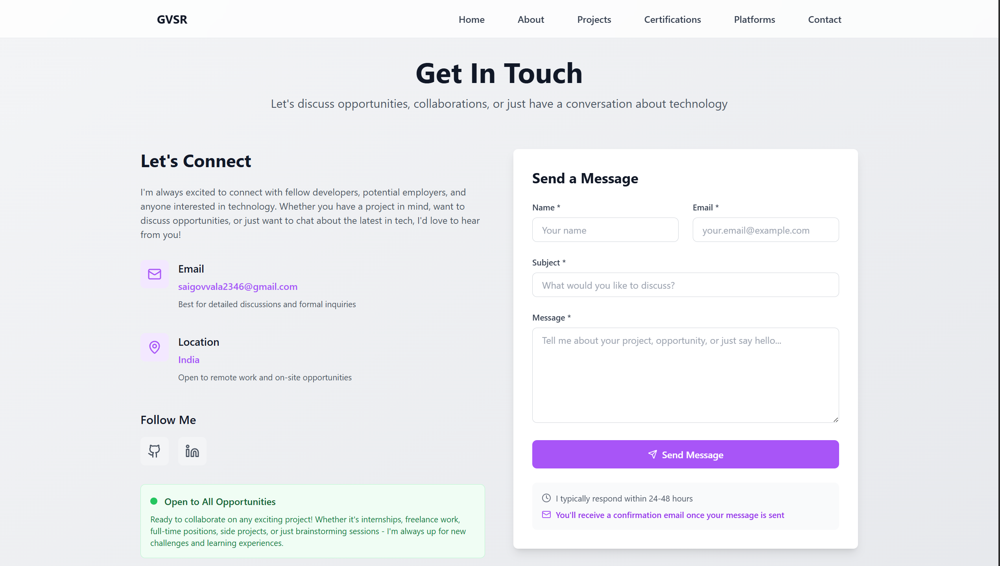

# 🚀 GVSR - Developer Portfolio

[](https://nextjs.org/)
[](https://www.typescriptlang.org/)
[](https://tailwindcss.com/)
[](https://opensource.org/licenses/MIT)
[](https://gvsr.dev)

## ✨ Features

- 🎨 **Modern Design** - Clean, professional UI with 0.1s consistent animations
- 📱 **Fully Responsive** - Perfect on desktop, tablet, and mobile devices
- ⚡ **High Performance** - Optimized for speed, SEO, and user experience
- 🏆 **Dynamic Stats** - Auto-updating problem counts (2463+ problems solved)
- 🔧 **Type Safe** - Built with TypeScript for maximum reliability
- 🎭 **Interactive Animations** - Smooth hover effects and transitions
- 📧 **Functional Contact** - Working contact form with email integration
- 🌓 **Theme Support** - Light/dark mode with consistent branding
- 📊 **Platform Integration** - Showcasing 8+ coding platforms and achievements
- 🎯 **Professional Animations** - Come-forward/backward effects with perfect timing

## 🖥️ Live Demo

🔗 **[gvsr.dev](https://gvsr.dev)** - Experience the portfolio live!

> **💡 Tip**: Please read the [Contributing Guidelines](CONTRIBUTING.md) before exploring the codebase or making contributions.

## 📷 Screenshots

<details>
<summary>🎨 Click to view portfolio screenshots</summary>

### 🏠 Home Page

*Clean, professional landing page with dynamic animations and my name*

### 👨‍💻 About Section  

*Personal information, skills showcase, and professional timeline*

### 🚀 Projects Gallery

*Interactive project showcase with filtering and detailed views*

### 🏆 Platforms Dashboard

*Dynamic stats from 8+ coding platforms showing 2463+ problems solved*

### 📜 Certifications

*Professional certifications and achievements display*

### 📞 Contact Page

*Functional contact form with live availability status and blinking green indicator*


</details>

## 🏗️ Architecture

```
portfolio/
├── frontend/          # Next.js 15 + TypeScript + Tailwind
└── backend/           # Express.js + TypeScript API (optional)
```

## 🛠️ Tech Stack

### Frontend
- **Next.js 15.5.3** - React 19.1.0 framework with App Router
- **TypeScript 5** - Complete type safety and developer experience
- **Tailwind CSS 3.4.17** - Utility-first styling with custom animations
- **Framer Motion 12.23.16** - Professional animations and transitions
- **Lucide React 0.544.0** - Beautiful, consistent icons

### Backend
- **Node.js + Express.js** - REST API for contact form
- **Nodemailer** - Email service integration with Gmail
- **TypeScript** - Type-safe backend development
- **CORS** - Cross-origin resource sharing

## 🚀 Quick Start

### Prerequisites
- Node.js 18+ 
- npm or yarn

### Local Development

```bash
# Clone the repository
git clone <your-repo-url>
cd portfolio

# Install dependencies
npm run install:all

# Start development server
npm run dev

# Or start services individually
npm run dev:frontend  # Frontend only (http://localhost:3000)
npm run dev:backend   # Backend API (http://localhost:8000)
```

## 📝 Available Scripts

```bash
# Docker commands
npm run dev          # Start development with hot reload
npm run build        # Build production images
npm run start        # Start production containers
npm run stop         # Stop all containers
npm run clean        # Remove containers and images

# Local development
npm run dev:frontend # Start frontend only
## 📦 Build and Production

```bash
# Build frontend for production
npm run build

# Start production server
npm start

# Type check
npm run type-check

# Lint code
npm run lint
```

## 🌐 Services

- **Frontend**: http://localhost:3000
- **Backend API**: http://localhost:8000 (if using backend)
- **API Health**: http://localhost:8000/api/health (if using backend)

## 📂 Project Structure

```
frontend/
├── src/
│   ├── app/           # Next.js App Router pages
│   ├── components/    # Reusable components
│   ├── lib/           # Utilities and configurations
│   └── data/          # Static data and content
└── public/            # Static assets

backend/               # Optional backend
├── src/
│   └── index.ts       # Express server
├── package.json
└── tsconfig.json
```

## 🎨 Customization

### 📋 Data Configuration
1. **Personal Information**: Update `frontend/src/data/site.ts`
2. **Projects Showcase**: Modify `frontend/src/data/projects.ts`
3. **Skills & Technologies**: Edit `frontend/src/data/skills.ts`
4. **Professional Timeline**: Update `frontend/src/data/timeline.ts`
5. **Coding Platforms**: Update `frontend/src/data/platforms.ts`
6. **Certifications**: Modify `frontend/src/data/certifications.ts`

### 🎯 Key Features to Customize
- **Stats Auto-Update**: Platform stats automatically calculate from data
- **Animation Timing**: All animations use consistent 0.1s timing
- **Color Schemes**: Professional color palette with hover effects
- **Contact Integration**: Functional email system with auto-replies

## 🚢 Deployment

### Recommended Platforms

#### **Vercel (Recommended for Frontend)**
```bash
# Install Vercel CLI
npm i -g vercel

# Deploy
vercel --prod
```

#### **Netlify**
```bash
# Install Netlify CLI
npm i -g netlify-cli

# Build and deploy
npm run build
netlify deploy --prod --dir=frontend/.next
```

#### **Railway/Render (For Full-Stack)**
- Connect your GitHub repository
- Configure build commands
- Deploy automatically on push

## 🔧 Environment Variables

Create `.env.local` in frontend directory:

```env
NEXT_PUBLIC_SITE_URL=https://yoursite.com
NEXT_PUBLIC_API_URL=https://your-api.com (if using backend)
```

## 🐛 Troubleshooting

### Common Issues

1. **Build errors**: Run `npm run type-check` to identify TypeScript issues
2. **Port conflicts**: Change port in `next.config.ts` or use different terminal
3. **Environment variables**: Ensure `.env.local` is properly configured

### Development Tips

1. Use `npm run dev` for hot reload development
2. Run `npm run build` to test production builds locally
3. Use `npm run lint` to catch code quality issues

## 📄 License

MIT License - feel free to use this project for your own portfolio!

## 🌟 Show Your Support

If this project helped you, please consider:
- ⭐ **Starring** this repository
- 🍴 **Forking** it for your own use
- 🐛 **Reporting** any issues you find
- 💡 **Suggesting** new features

## 🤝 Contributing

Contributions are welcome! Please read our [Contributing Guidelines](CONTRIBUTING.md) for detailed information about our development process, coding standards, and submission guidelines.

**Quick Start for Contributors:**
1. Fork the repository
2. Read [CONTRIBUTING.md](CONTRIBUTING.md) for setup and guidelines
3. Create a feature branch (`git checkout -b feature/AmazingFeature`)
4. Follow our coding standards and animation timing (0.1s consistency)
5. Commit your changes (`git commit -m 'Add some AmazingFeature'`)
6. Push to the branch (`git push origin feature/AmazingFeature`) 
7. Open a Pull Request with detailed description

**Before Contributing**: Please ensure you understand our animation standards, data structure patterns, and TypeScript conventions outlined in the contributing guide.

## 👨‍💻 Author

**Govvala Venkata Sai Ram (GVSR)**
- 🌐 Portfolio: [gvsr.dev](https://gvsr.dev)
- 💼 GitHub: [@gvsrgh](https://github.com/gvsrgh)
- 🔗 LinkedIn: [gvsr](https://linkedin.com/in/gvsr)
- 📧 Email: saigovvala2346@gmail.com
- 🏆 Achievements: 2463+ problems solved across platforms

## 🙏 Acknowledgments

- [Next.js](https://nextjs.org/) for the amazing React framework
- [Tailwind CSS](https://tailwindcss.com/) for the utility-first CSS framework
- [Framer Motion](https://www.framer.com/motion/) for beautiful animations
- [Lucide](https://lucide.dev/) for the clean, customizable icons

---

<div align="center">
  Made with ❤️ and ☕ by <strong>GVSR</strong>
</div>